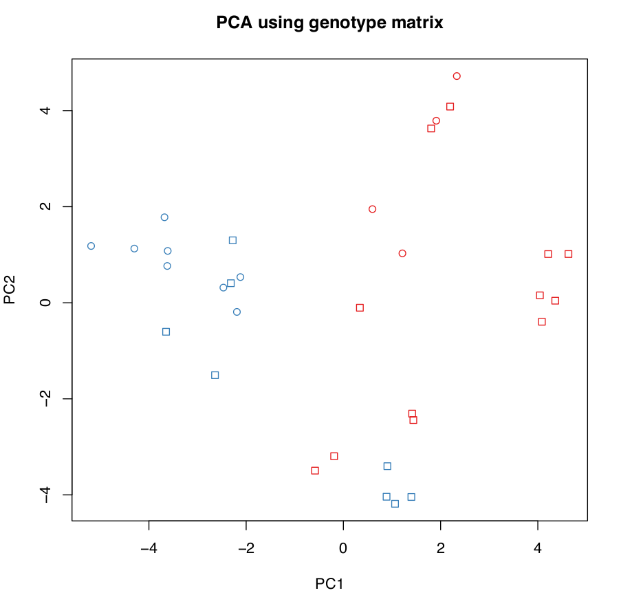

## PCA of genoypes

We are going to carry out PCA using R. For that, we will convert our BCF file to mean genotype format (based on the BIMBAM format), where genotypes are encoded as mean genotypes. A mean genotype is a value between 0 and 2 that can be interpreted as the minor allele dosage: 0 is homozygous for the major allele, 1 is a heterozygote, and 2 is a homozygote for the minor allele. Although genotype calls can be used, it is also possible to use genotype likelihoods to get intermediate values that incorporate uncertainty in genotype calling. We are going to do that here. We are going to use a custom Perl script called ``bcf2bbgeno.pl`` to get mean genotypes as empirical posterior genotype probabilites. This script (1) removes all the SNPs that have more than two alleles and (2) calculates empirical posterior genotype probabilities from the genotype likelihoods in the BCF file under the assumption that the population is in Hardy-Weinberg equilibrium (HWE). Specifically, the script uses inferred allele frequencies to set HWE priors:

*p(AA) = p²; p(aa) = (1-p)²; p(Aa) = 2p(1-p)*

being *p* the allele frequency of major/reference allele *A*. Genotype likelihoods are multiplied by these priors to obtain genotype posterior probabilities that are then encoded as mean genotypes (i.e. single values from 0 to 2) and saved to a file with extension .bbgeno. You can get some info about how to run the Perl script witn ``bcf2bbgeno.pl -h``. 

Let's start. We are going to create a directory for this practical, download the ``bcf2bbgeno.pl`` from the github repository, grant execute permission, and show the help:

```bash
# create directory for PCA practical
mkdir /fastdata/$USER/varcal/pca

# change to directory
cd /fastdata/$USER/varcal/pca

# download bfc2bbgeno.pl script
wget https://raw.githubusercontent.com/visoca/SNP-and-genotype-calling/master/scripts/bcf2bbgeno.pl

# grant execute permission
chmod +x bcf2bbgeno.pl

# show help
./bcf2bbgeno.pl -h
```
We are going to use ``bcf2bbgeno.pl`` to calculate the genotype posterior probabilites from the BCF file of snps that we generated in the previous sessions and save them in mean genotype format. We will need to run a command like this one, including the flag to include a header with the sample names:
```bash
./bcf2bbgeno.pl -i ../filtering/snps.bcf -o snps.bbgeno -p H-W -a
```
Be aware that samples here are not individuals, but individuals-tissue. For instance, 80I and 80A come from the same invidual, but from different tissues.

To make sense of the PCA plots, we will also need the information about the race and sex of the samples, which can be copied from a shared directory in ShARC:
```bash
cp /usr/local/extras/Genomics/workshops/NGS_AdvSta_2019/SNPgenocall/sample_race_sex.tsv ./ 
head sample_race_sex.tsv
```
Then we will use R to do PCA with the mean genotypes, followed by some plotting. For this part, you may want to use a graphical SSH connection (already the default with MobXterm, use the -X flag in Linux and MacOS) and launch an interactive graphical session with `qsh` instead of `qrsh`. This way, you will be able to visualize your plots instead of having to redirect them to files and download them. However, some people find the graphical terminal that is opened when using `qsh` annoying and inestable. In the following steps it is assumed you don't have graphical capabilities and all outputs will be directed to files. The first step is to launch an interactive R session:
```bash
R
```
and you should see something like this:

>``R version 3.4.3 (2017-11-30) -- "Kite-Eating Tree"``<br>
>``Copyright (C) 2017 The R Foundation for Statistical Computing``<br>
>``Platform: x86_64-pc-linux-gnu (64-bit)``<br>
><br>
>``R is free software and comes with ABSOLUTELY NO WARRANTY.``<br>
>``You are welcome to redistribute it under certain conditions.``<br>
>``Type 'license()' or 'licence()' for distribution details.``<br>
><br>
>``  Natural language support but running in an English locale``<br>
><br>
>``R is a collaborative project with many contributors.``<br>
>``Type 'contributors()' for more information and``<br>
>``'citation()' on how to cite R or R packages in publications.``<br>
><br>
>``Type 'demo()' for some demos, 'help()' for on-line help, or``<br>
>``'help.start()' for an HTML browser interface to help.``<br>
>``Type 'q()' to quit R.``<br>
><br>
>``> ``<br>

Bear in mind that the commands hereafter are R commands. First, let's load the genotypes:

```R
## load genotypes
genotypes<-read.table("snps.bbgeno",header=T, check.names=F)
head(genotypes)
```
We can now do a the PCA with the genotype matrix excluding the first 3 columns that contain information for SNP id, reference allele and alternate allele:
```R
pca.genotypes<-prcomp(t(genotypes[,-(1:3)]), center=TRUE, scale=FALSE)
```
then we can have a look at the proportion of variance explained by each PC:
```R
summary(pca.genotypes)
```
As you can see, ~50% of the variance is explained by the first 4 PCs. We will extract the PCs vectors and plot them by pairs (i.e. PC1xPC2, PC2xPC3, PC3xPC4):
```R
pcs<-pca.genotypes$x
pdf(file="genotype_matrix-pc1-pc4.pdf")
plot(pcs[,1], pcs[,2], main = "PCA using genotype matrix", xlab = "PC1", ylab = "PC2")
plot(pcs[,2], pcs[,3], main = "PCA using genotype matrix", xlab = "PC2", ylab = "PC3")
plot(pcs[,3], pcs[,4], main = "PCA using genotype matrix", xlab = "PC3", ylab = "PC4")
dev.off()
```
It seems there is some sort of structure, but we can't tell much more with this kind of plot. Let's use the information about the samples (race and sex) and use that to assign colours to races and symbols to sexes:
```R
# Load info about samples
id.info<-read.table("sample_race_sex.tsv", sep="\t", header=T)

# sort as in the pcs
id.info<-id.info[match(rownames(pcs), id.info$sample),]

# colours
id.colours<-as.character(id.info$race)
id.colours[id.colours=="R"]<-"#E41A1C" # R as red
id.colours[id.colours=="C"]<-"#377EB8" # C as blue
mycol<-c("#E41A1C","#377EB8","#4DAF4A","#984EA3")

# symbols
id.symbols<-as.character(id.info$sex)
id.symbols[id.symbols=="F"]<-1 # females as circles
id.symbols[id.symbols=="M"]<-0 # males as squares
id.symbols<-as.numeric(id.symbols)

# Get PCs
pcs<-pca.genotypes$x

pdf(file="genotype_matrix-pc1-pc4-colsym.pdf")
plot(pcs[,1], pcs[,2], main = "PCA using genotype matrix", xlab = "PC1", ylab = "PC2", pch=id.symbols, col=id.colours)
plot(pcs[,2], pcs[,3], main = "PCA using genotype matrix", xlab = "PC2", ylab = "PC3", pch=id.symbols, col=id.colours)
plot(pcs[,3], pcs[,4], main = "PCA using genotype matrix", xlab = "PC3", ylab = "PC4", pch=id.symbols, col=id.colours)
dev.off()
```
It should look like this:



There is some clear structure: PC1 separates samples by race in two groups. However, some samples seem to be in an unexpected position. Let's investigate that further by plotting the id of the samples;
```R
pdf(file="genotype_matrix-pc1-pc4-labels.pdf")
plot(pcs[,1], pcs[,2], type="n", main = "PCA using genotype matrix", xlab = "PC1", ylab = "PC2")
text(pcs[,1], pcs[,2],labels=rownames(pcs),col=id.colours,cex=0.5)
plot(pcs[,2], pcs[,3], type="n", main = "PCA using genotype matrix", xlab = "PC2", ylab = "PC3")
text(pcs[,2], pcs[,3],labels=rownames(pcs),col=id.colours,cex=0.5)
plot(pcs[,3], pcs[,4], type="n", main = "PCA using genotype matrix", xlab = "PC3", ylab = "PC4")
text(pcs[,3], pcs[,4],labels=rownames(pcs),col=id.colours,cex=0.5)
dev.off()
```

Now we will use an alternative method using the genotype covariance matrix (which results in a N x N matrix, being N the samples):
```R
## calculate N x N genotype covariance matrix
gmn<-apply(genotypes[,-(1:3)],1,mean)
nids<-ncol(genotypes)-3
nloci<-nrow(genotypes)
gmnmat<-matrix(gmn,nrow=nloci,ncol=nids)
gprime<-genotypes[,-(1:3)]-gmnmat

gcovarmat<-matrix(NA,nrow=nids,ncol=nids)
for(i in 1:nids){
 for(j in i:nids){
  if (i==j){
    gcovarmat[i,j]<-cov(gprime[,i],gprime[,j])
  }
  else{
    gcovarmat[i,j]<-cov(gprime[,i],gprime[,j])
    gcovarmat[j,i]<-gcovarmat[i,j]
  }
 }
}

pca.covar<-prcomp(gcovarmat, center=TRUE, scale=FALSE)

summary(pca.covar)
```
You can see now that the first 4 PCs explain >80% of the variance. Let's plot the results:
```R
# Get PCs
pcs<-pca.covar$x
rownames(pcs)<-colnames(genotypes[,-(1:3)])

pdf(file="genotype_covmatrix-pc1-pc4-labels.pdf")
plot(pcs[,1], pcs[,2], type="n", main = "PCA using genotype covariance matrix", xlab = "PC1", ylab = "PC2")
text(pcs[,1], pcs[,2],labels=rownames(pcs),col=id.colours,cex=0.5)
plot(pcs[,2], pcs[,3], type="n", main = "PCA using genotype covariance matrix", xlab = "PC2", ylab = "PC3")
text(pcs[,2], pcs[,3],labels=rownames(pcs),col=id.colours,cex=0.5)
plot(pcs[,3], pcs[,4], type="n", main = "PCA using genotype covariance matrix", xlab = "PC3", ylab = "PC4")
text(pcs[,3], pcs[,4],labels=rownames(pcs),col=id.colours,cex=0.5)
dev.off()
```

The resolution of this PCA is not great, because it is based in just a few hundreds of SNPs. Let's now download data for a tens of thousands. For that, first exit the R session:
```R
q()
```
And now copy the BCF file and get the mean genotypes:
```bash
# copy data
cp /usr/local/extras/Genomics/workshops/NGS_AdvSta_2019/SNPgenocall/snps-large.bcf* ./ 
# check number of SNPs
bcftools view -H snps-large.bcf | wc -l
# Get mean genotypes
./bcf2bbgeno.pl -i snps-large.bcf -o snps-large.bbgeno -p H-W -a
```
Let's launch `R` again, do PCA and plot the first 4 PCs as before:
```R
## load genotypes
genotypes<-read.table("snps-large.bbgeno",header=T, check.names=F)

# Load info about samples
id.info<-read.table("sample_race_sex.tsv", sep="\t", header=T)

# sort as in the pcs
id.info<-id.info[match(rownames(pcs), id.info$sample),]

# colours
id.colours<-as.character(id.info$race)
id.colours[id.colours=="R"]<-"#E41A1C" # R as red
id.colours[id.colours=="C"]<-"#377EB8" # C as blue
mycol<-c("#E41A1C","#377EB8","#4DAF4A","#984EA3")

# symbols
id.symbols<-as.character(id.info$sex)
id.symbols[id.symbols=="F"]<-1 # females as circles
id.symbols[id.symbols=="M"]<-0 # males as squares
id.symbols<-as.numeric(id.symbols)

# do PCA
pca.genotypes<-prcomp(t(genotypes[,-(1:3)]), center=TRUE, scale=FALSE)
summary(pca.genotypes)

# get PCs
pcs<-pca.genotypes$x

pdf(file="genotype_matrix-large-pc1-pc4-colsym.pdf")
plot(pcs[,1], pcs[,2], main = "PCA using large genotype matrix", xlab = "PC1", ylab = "PC2", pch=id.symbols, col=id.colours)
plot(pcs[,2], pcs[,3], main = "PCA using large genotype matrix", xlab = "PC2", ylab = "PC3", pch=id.symbols, col=id.colours)
plot(pcs[,3], pcs[,4], main = "PCA using large genotype matrix", xlab = "PC3", ylab = "PC4", pch=id.symbols, col=id.colours)
dev.off()

pdf(file="genotype_matrix-large-pc1-pc4-labels.pdf")
plot(pcs[,1], pcs[,2], type="n", main = "PCA using genotype matrix", xlab = "PC1", ylab = "PC2")
text(pcs[,1], pcs[,2],labels=rownames(pcs),col=id.colours,cex=1)
plot(pcs[,2], pcs[,3], type="n", main = "PCA using genotype matrix", xlab = "PC2", ylab = "PC3")
text(pcs[,2], pcs[,3],labels=rownames(pcs),col=id.colours,cex=1)
plot(pcs[,3], pcs[,4], type="n", main = "PCA using genotype matrix", xlab = "PC3", ylab = "PC4")
text(pcs[,3], pcs[,4],labels=rownames(pcs),col=id.colours,cex=1)
dev.off()
```
Now you can see samples the separation is clearer, and the outliers are different samples. There is one on the middle of the plot separated from all others, and there are other two clustering with the 'wrong' group. Why may this be happening?
